# levente-toth - T1A3 - Portfolio

## Deployed Site

[https://www.levtoth.dev](https://www.levtoth.dev)

## GitHub Repo

[https://github.com/LevPewPew/levente-toth](https://github.com/LevPewPew/levente-toth)

## Description

### Purpose

This site was designed to show case my work to potential employers or clients looking to utilise my services and skills as a Fullstack Web Developer.

### Functionality / features

A Home page designed to to be aesthetically appealing and interesting to draw in the user to want to know more.

An About Me page to tell the user my interests and aspects of my personality as well as a picture of myself. This page also lists what tech I know with a little animation on each, it is laid out in a Grid as this was the easiest way I found to manage the disappearance/appearance of the tech text and its animation.

A Portfolio page that showcases projects I have worked on. Each project has been placed on a card with some animations. Projects can be added to this page easily when more are completed in the future due to the Flexbox and scroll mechanism. I can just add a new card component into the HTML and everything else will expand and accomodate the extra card accordingly. A download button is also included for my resume, it will download a PDF file to the users computer.

A Blog page with blog posts and an image float for each. The blogs can be scrolled through or the aside can be used to see the full list of posts and navigate directly to a blog post.

A Contact page with a form. Using this form will send me an email with all the details entered into the input fields by the user. This form uses the third party [Form Spree](https://formspree.io/) to manage the sending and receiving of forms.

Icons for company logos, implemented using a combination of [Font Awesome](https://fontawesome.com/) and [Mfizz](http://fizzed.com/oss/font-mfizz). Custom fonts from [Google Fonts](https://fonts.google.com/).

SVG components. For general "decoration" images (images other than my profile picture or the blog post images) I used SVG to draw shapes onto the screen.

Icons in the footer for various contact and project websites I use.

Responsive design to accomodate for smaller screens and mobiles. This was achieved with the use of a burger nav menu and a slide out tab for the blog links on the blog page. There are also several media queries that do various modifications such as changing some Flexboxes from row to column, decreasing font-size and various changes to padding and margins to suit the new proportions better.

### Sitemap

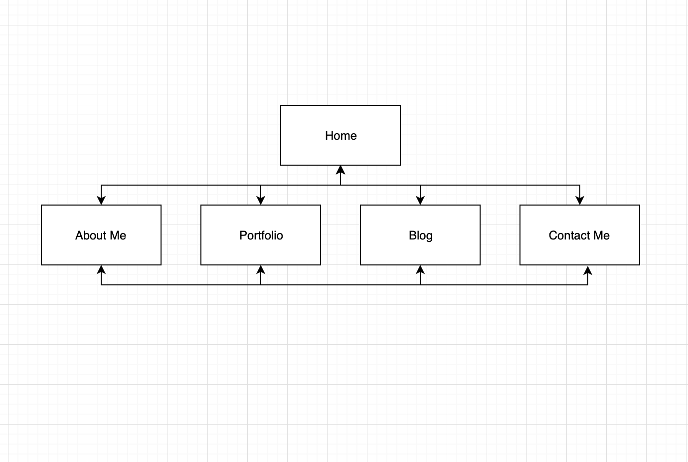

### Screenshots

#### Home Page

##### Wireframe

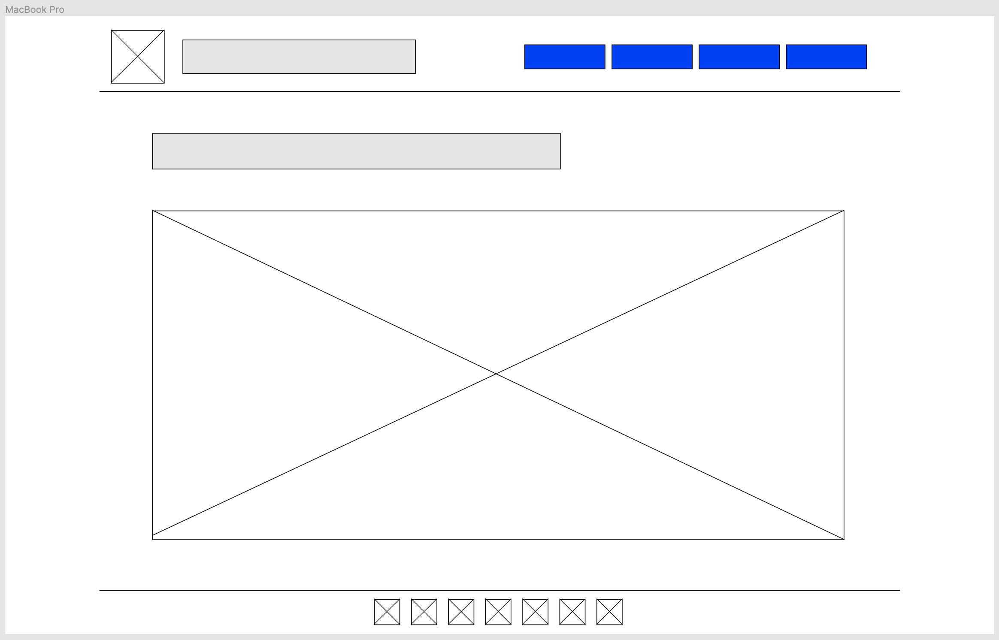

##### Final Result

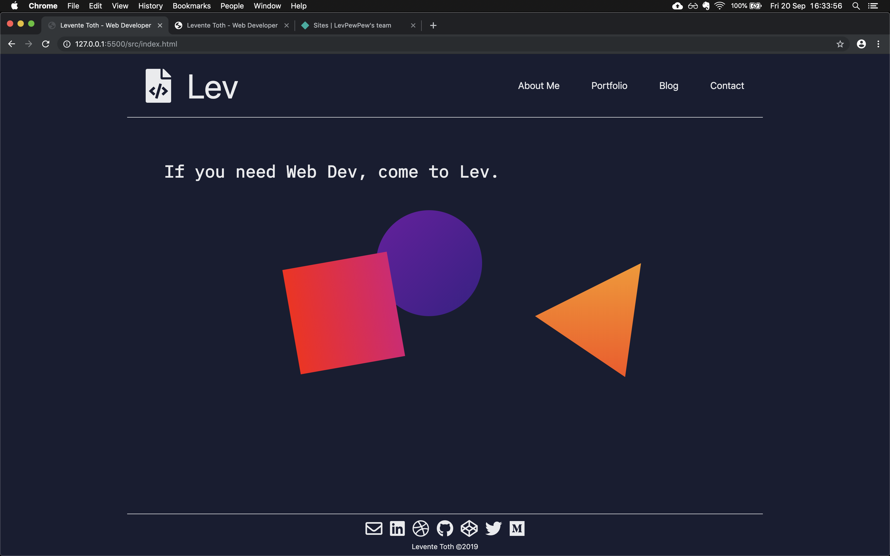

#### About Me

##### Wireframe

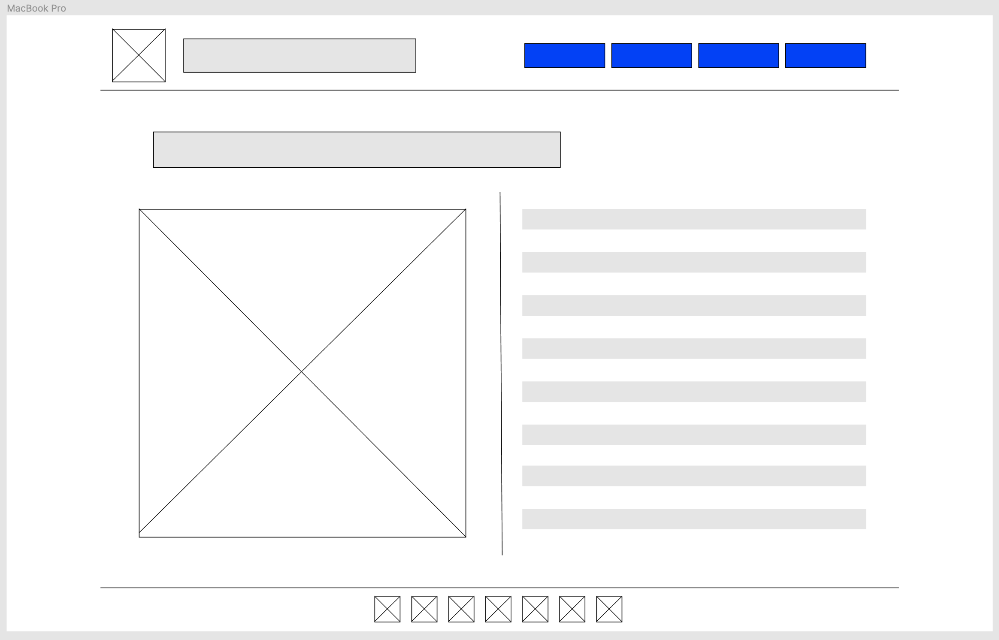

##### Final Result

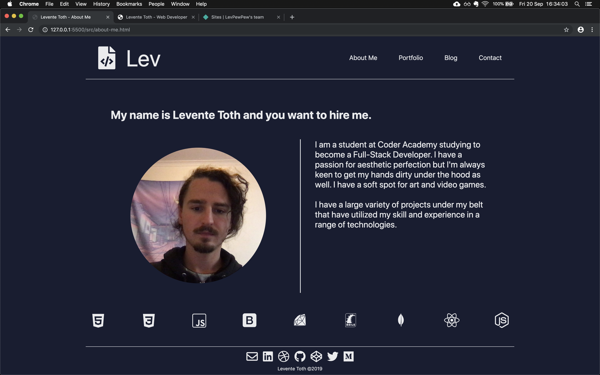

#### Portfolio

##### Wireframe

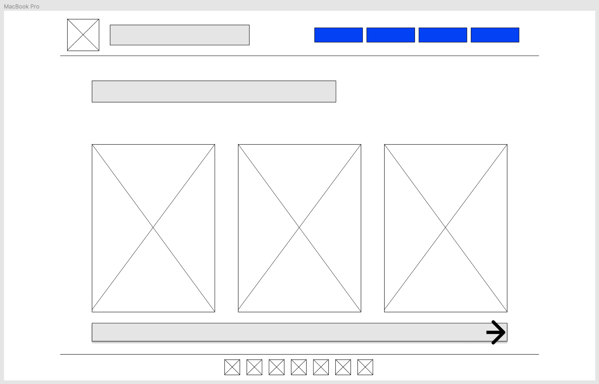

##### Final Result

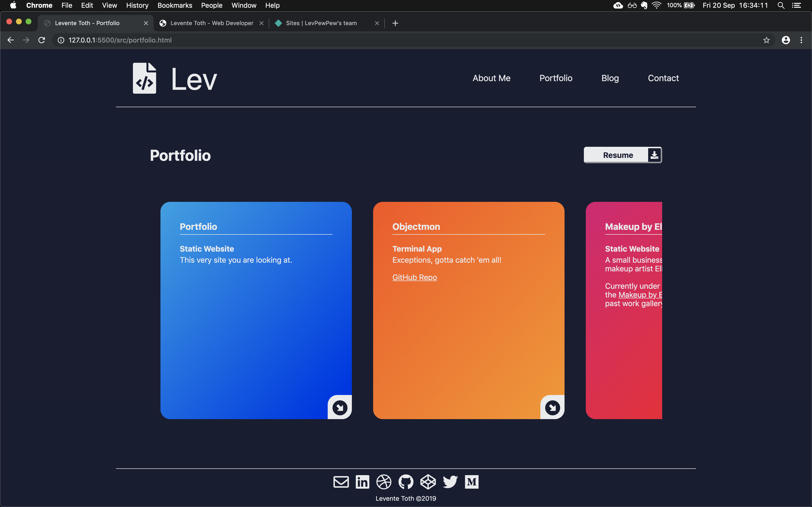

#### Blog

##### Wireframe

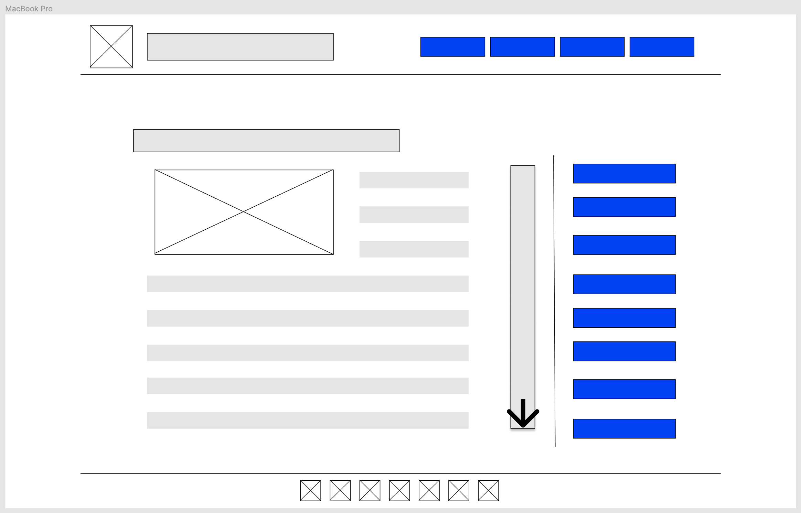

##### Final Result

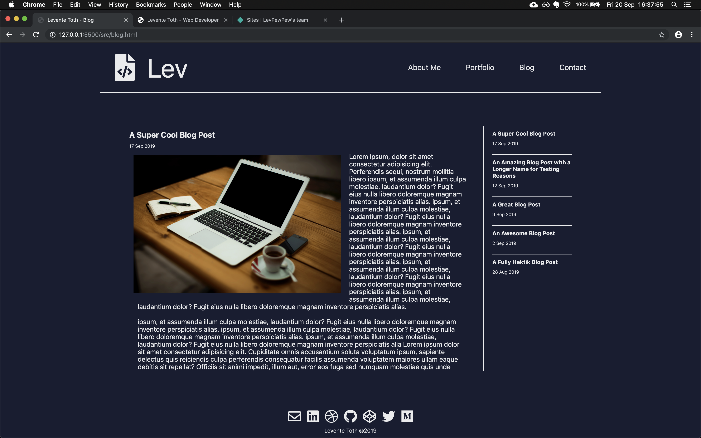

#### Contacts

##### Wireframe

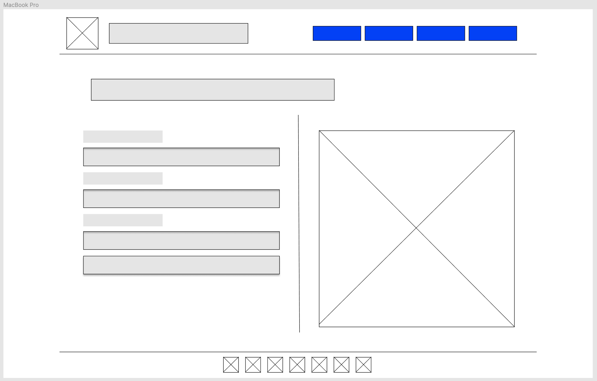

##### Final Result

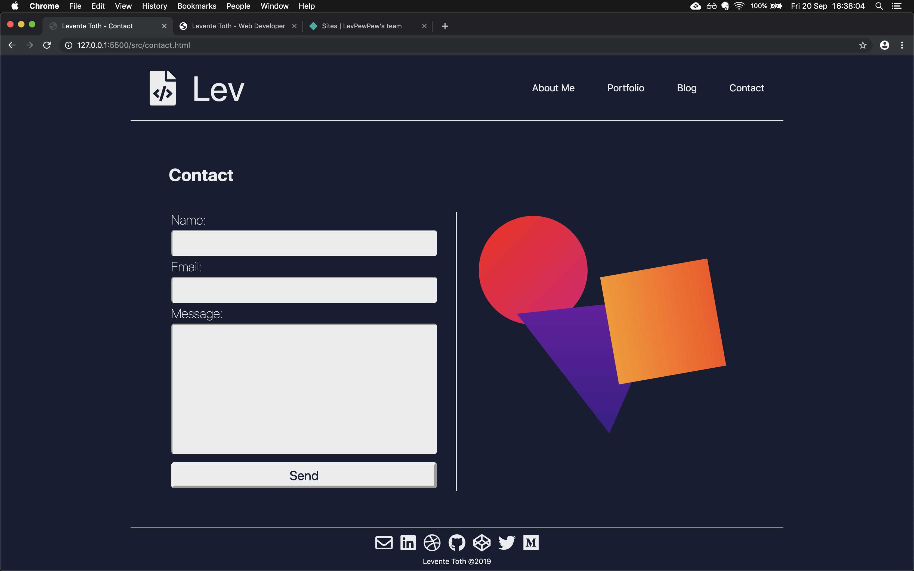

#### Dribbble Bucket Inspiration
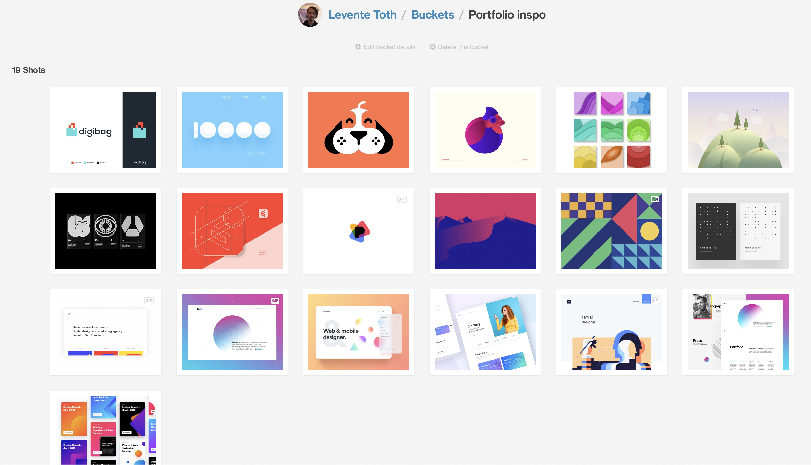

#### Coolors Pallete
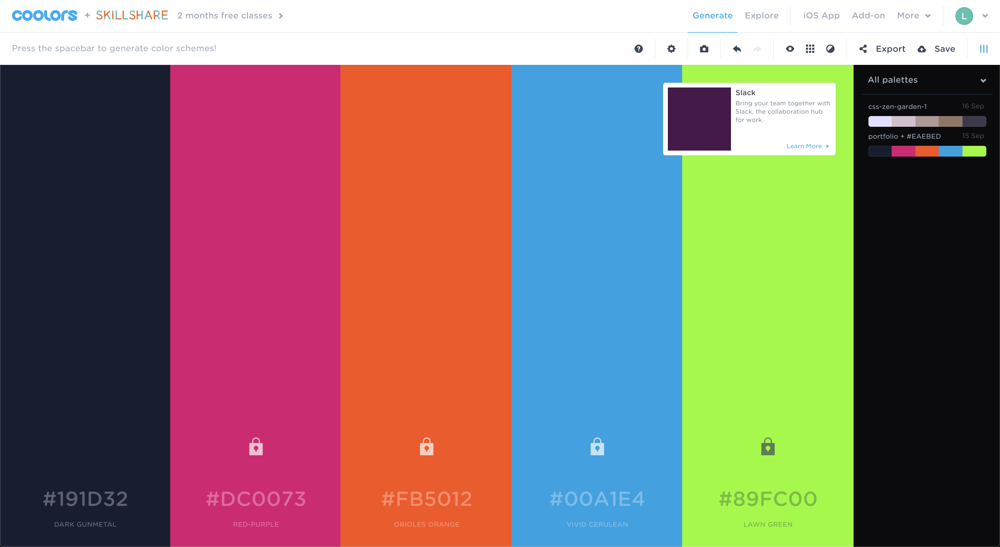

#### Paletton Palette
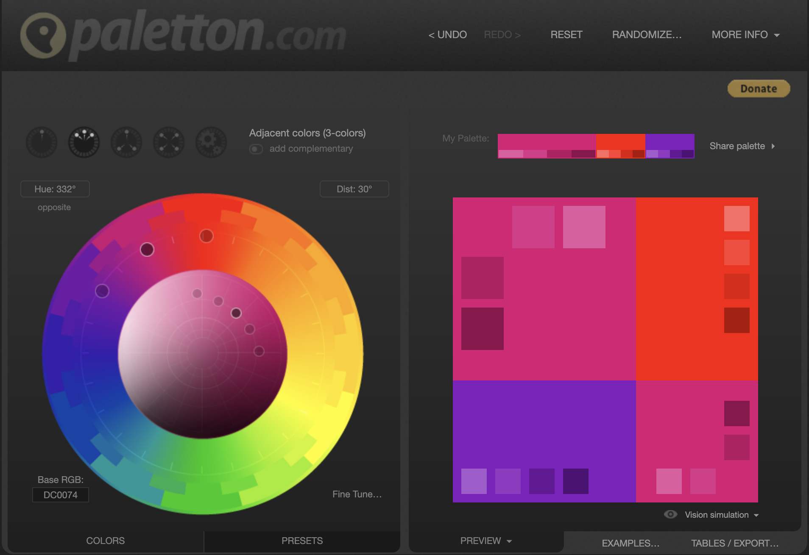

### Target audience

Recruiters, Management or HR of a company, freelance Clients, other Developers.

### Tech stack (e.g. html, css, deployment platform, etc)

- HTML
- CSS
- [Netlify](https://app.netlify.com/teams/levpewpew/sites)